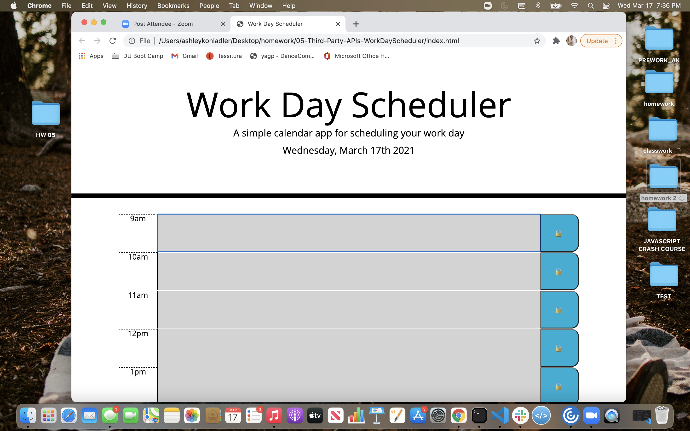

# 05-Third-Party-APIs-WorkDayScheduler

# Homework 5

## Description of my work 

* This is a basic day planner app that loops through the hours of 9am - 5pm for a specific date, today. 

* When you open the planner the current date appears at the top.

* The app uses moment.js to handle time.

* When you click into a timeblock
then you can enter an event.

* When you click the save button for that timeblock, the data will be saved to the localStorage of the browser.

* Each timeblock is color coded to indicate whether it is in the past (gray), present (red), or future (green.)

## Link to Website - 
 https://ashleykohladler.github.io/05-Third-Party-APIs-WorkDayScheduler/

## Screenshot
